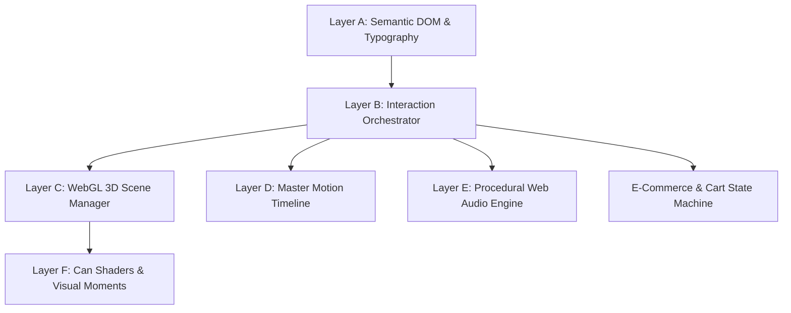

# GRIZZLY ENERGY (Ciao Energy Digital Flagship)

> **Next-Generation 3D Web Experience & Digital Flagship**  
> Recreating and elevating the physical product theatre of Ciao Energy / Grizzly Energy through procedural PBR WebGL, physics-driven scroll choreography, real-time Web Audio synthesis, full-funnel commerce, and enterprise accessibility (WCAG 2.2 AA).

[](https://www.typescriptlang.org/)
[](https://react.dev/)
[](https://threejs.org/)
[](https://vitejs.dev/)
[](https://gsap.com/)
[](https://lenis.darkroom.engineering/)
[](https://vitest.dev/)
[](https://playwright.dev/)
[](https://www.w3.org/WAI/standards-guidelines/wcag/)
[]()

---

## ⚡ Quick Navigation

- [Overview & Creative Direction](#-overview--creative-direction)
- [Flavor Lineup](#-flavor-lineup)
- [System Architecture](#-system-architecture)
- [WebGL 3D Engine & Shaders](#-webgl-3d-engine--shaders)
- [Procedural Web Audio Engine](#-procedural-web-audio-engine)
- [E-Commerce & Storefront](#-e-commerce--storefront)
- [Performance & Hardware Scaling](#-performance--hardware-scaling)
- [Accessibility & Progressive Enhancement](#-accessibility--progressive-enhancement)
- [SEO, AEO & Static Prerendering](#-seo-aeo--static-prerendering)
- [Project Directory Structure](#-project-directory-structure)
- [Getting Started & Local Setup](#-getting-started--local-setup)
- [Testing & Quality Assurance](#-testing--quality-assurance)

---

## 🌌 Overview & Creative Direction

GRIZZLY ENERGY is a high-performance, single-page immersive 3D marketing and e-commerce experience. Built to faithfully recreate and surpass the Ciao Energy marketing aesthetic, the experience fuses high-fashion product minimalism with visceral, tactile physical details:

* **Futuristic & Minimalist:** A deep, neutral-grey and obsidian studio backdrop punctuated only by focused light and flavor accents.
* **Physical & Tactile:** Real-time brushed aluminum surfaces, procedural condensation with run-down droplet physics, light refraction, and metallic sheen.
* **Product-First:** The 3D can is always the hero; text, navigation, and UI frame the can without ever obscuring it.
* **Deterministic Scroll Choreography:** Smooth, unified timeline synchronization where scroll progress directly drives camera trajectories, lighting, and physical can transformations.
* **Zero Bloat:** Pure WebGL shaders, zero heavy external audio files (100% procedural Web Audio synthesis), clean semantic DOM, and sub-second initial paint.

---

## 🥫 Flavor Lineup

The experience showcases 6 bespoke flavors, each tied to a synchronized 3D lighting environment, color accent palette, and physical can artwork:

| Flavor | Accent Token | Accent Hex | Notes & Profile | Edition |
| :--- | :--- | :--- | :--- | :--- |
| **Blue Raspberry** | `--accent-blue` | `#2a4fd0` | Sour-sweet berry burst with clean, electrifying lift | Core |
| **Mango Fuego** | `--accent-mango` | `#f5a623` | Tropical ripe mango infused with a subtle fiery warmth | Core |
| **Watermelon** | `--accent-melon` | `#2f7a3b` | Crisp summer watermelon, chilled and ultra-hydrating | Core |
| **Strawberry Kiwi** | `--accent-strawberry` | `#d02a48` | Sweet sun-ripened strawberry balanced with tangy kiwi | Core |
| **Peach** | `--accent-peach` | `#f3a074` | Velvety white peach nectar with a smooth, refreshing finish | Core |
| **Blackout Berry** | `--accent-blackout` | `#4a2a78` | Deep wild blackberry and acai for midnight focus | Limited |

### Clean Formulation Claims
* **Natural Caffeine:** Extracted from green coffee beans for jitter-free focus.
* **Natural Electrolytes:** Himalayan & sea salt electrolytes for cell hydration.
* **Added Zamzam Water:** Premium water treatment in every can.
* **B-Vitamin Matrix:** B3, B5, B6, and B12 metabolic cofactors.
* **Halal Certified:** 100% halal certified formulation, zero artificial colors, zero preservatives.

---

## 🏛️ System Architecture

The application is structured into a disciplined 6-layer architecture to decouple 3D rendering loops from UI state changes:



1. **Layer A — Semantic DOM:** Clean HTML5 document tree with fluid type scales (`Geist`, `Geist Mono`, `Libre Franklin`). Never hides essential text inside WebGL.
2. **Layer B — Interaction Orchestrator:** Manages normalized scroll progress (`Lenis`), pointer parallax, touch gestures, reduced-motion preferences, and active route state.
3. **Layer C — WebGL Scene Manager:** Persistent Three.js renderer, custom camera controllers, PMREM studio environment, and geometry pooling.
4. **Layer D — Motion Timeline:** Deterministic GSAP timelines mapping scroll progress directly to scene coordinates and DOM reveals without triggering layout reflows.
5. **Layer E — Audio Synthesis:** Client-side Web Audio API synthesizers triggered by user gestures and spatial transitions.
6. **Layer F — Commerce & State:** LocalStorage-backed cart state machine with item validation, pack builders, promo codes, and multi-step checkout.

---

## 💎 WebGL 3D Engine & Shaders

### 1. Procedural Condensation Shader (`canModel.ts`)
* **Dual-Scale Sampling:** Samples a high-resolution 512×512 normal/height bead map at two non-repeating frequencies (`vec2(5.0, 4.0)` and `vec2(3.3, 2.7)`), eliminating visible tiling patterns across the cylinder.
* **Patchy Density Mask:** Low-frequency simplex noise groups water droplets into realistic organic clusters rather than an artificial uniform film.
* **Running Water Drops:** 28 radial lanes simulate water beads sliding down the can body with wobbling paths, leaving thinning wet wakes behind them.
* **Dynamic Highlight Back-Off:** When an ingredient benefit block is hovered or active, surface droplets automatically dim down by up to 55% so the typography stays razor sharp.

### 2. Can Anatomy & Physical Geometry
* **Aluminum Shell:** Realistic metal roughness (`MeshPhysicalMaterial`) with anisotropic brushed metal texturing on lids, rims, and base bevels.
* **Extruded Rim & Tab:** Precision lathe geometry for the can lid, beverage opening slot, and pop-tab void.
* **Color Accents & Varnish:** High-gloss varnish layer reflecting studio softboxes over satin-finish label art.

### 3. Studio Environment & Lighting (`studioEnv.ts` & `palette.ts`)
* **Zero HDRI Dependencies:** Procedurally generated studio room prefiltered using Three.js `PMREMGenerator`.
* **Light Rig:**
  * Overhead softbox for metal rim illumination.
  * Tall left key strip (`#f6f6f4`) creating a crisp gloss streak along the can edge.
  * Right fill strip (`#e8e8e6`) for shadow-side definition.
  * Neutral floor bounce panel preventing dark voids.
  * Centralized palette system in `src/webgl/palette.ts`.

### 4. Choreographed Visual Moments (`src/webgl/moments/`)
* **Hero Carousel Ring:** Desktop 11-can tilted sweeping ring; mobile responsive arc.
* **Flavor Profile:** Can moves forward with interactive pointer rotation and floating accent particles.
* **Benefit Comparisons:** Smooth focus transitions highlighting green coffee beans, electrolytes, and Zamzam water.
* **Inside The Can:** Dynamic camera dive down the opening slot with swirling vortex particles.
* **Ice Dust & Fruit Fields:** Instanced 3D fruit pieces (kiwi, watermelon, mango, peach) with physical rotational tumble.
* **6-Can Finale Lineup:** Desktop mountain-shaped arc and mobile 2×3 grid with reflective wet floor highlights.

---

## 🔊 Procedural Web Audio Engine

Built in `src/audio/audioManager.ts` using the native **Web Audio API** without loading external audio assets:

* **Can Crack Sound:** Synthesized white noise burst filtered through a steep bandpass filter combined with an exponentially decaying low-frequency pop.
* **Effervescent Carbonation (Fizz):** High-frequency granulated noise simulating escaping CO₂ micro-bubbles.
* **Subtle Spatial Drone:** Dual-sine wave ambient hum modulated by scroll velocity and viewport proximity.
* **Interactive Haptics:** Subtle high-pass clicks on button hover, carousel navigation, and drawer toggles.
* **Mute/Unmute State:** Strict user gesture compliance with persistent audio preferences across routes.

---

## 🛒 E-Commerce & Storefront

A full-fledged direct-to-consumer store embedded within the experience:

* **Dynamic Product Catalog (`/shop`):** 6 individual flavor cans, multipacks, and limited editions.
* **Interactive Pack Builder (`PackBuilder.tsx`):** Custom 12-can and 24-can builder with instant visual feedback and bundle savings.
* **Slide-out Cart Drawer (`CartDrawer.tsx`):** Fly-to-bag animations, quantity stepper, free shipping progress bar, and instant line item removal.
* **Dedicated Checkout Flow (`/checkout`):** Order summary, promo code application, shipping calculator, billing form validation, and offline order confirmation simulation.
* **Limited Edition Drop Countdown (`LimitedCountdown.tsx`):** Real-time countdown timer for exclusive releases like Blackout Berry.

---

## 🚀 Performance & Hardware Scaling

To guarantee smooth 60fps across phones, laptops, and ultra-wide workstations, the engine dynamically adjusts to device capability:

* **Quality Tier Classification (`devicePower.ts`):** Automatically assigns devices to `HIGH`, `MEDIUM`, `LOW`, or `STATIC` tiers based on core count, GPU renderer strings, and memory benchmarks.
* **Device Pixel Ratio (DPR) Clamping:** DPR is capped at 1.75 on desktop and 1.5 on mobile to eliminate GPU memory throttling on Retina/4K screens.
* **Deferred Initialization:** Non-critical 3D moments (inside-can, fruit particles, finale lineup) are initialized in background idle callbacks (`requestIdleCallback`) after the first paint.
* **Offscreen Intersection Pausing:** WebGL canvas rendering automatically halts when scrolled offscreen or when browser tab visibility is lost.
* **Deterministic Memory Management:** All geometries, textures, materials, and render targets are strictly disposed of on route transitions.

---

## ♿ Accessibility & Progressive Enhancement

Fully compliant with **WCAG 2.2 Level AA** standards:

* **Screen Reader Friendly Headings (`RevealText.tsx`):** Split-character decorative title animations are hidden from assistive technology (`aria-hidden="true"`), while full, clean accessible names (`aria-label="Watermelon"`) are announced to screen readers.
* **Reduced Motion Mode (`prefers-reduced-motion`):** Automatically disables camera swings, particle drift, and fast rotations, replacing them with subtle, clean fades.
* **Keyboard Navigation:** Full tab order throughout the carousel, product drawers, pack builder, FAQ accordions, and checkout inputs with high-contrast `:focus-visible` outlines.
* **Non-WebGL Fallback Stage (`FallbackStage.tsx`):** If WebGL is unsupported or disabled, a static photographic stage with clean CSS layout seamlessly replaces the 3D canvas.
* **Touch Optimization:** All interactive controls maintain a minimum 44×44px hit target on touch devices.

---

## 🔍 SEO, AEO & Static Prerendering

* **14 Static Prerendered Routes:** Precomputed via `scripts/prerender.mjs`:
  * `/` (Home Showcase)
  * `/shop` (Storefront)
  * `/product/:slug` (6 flavor product detail pages)
  * `/halal` (Halal Water Treatment & Certification)
  * `/privacy` (Privacy Policy)
  * `/cart` & `/checkout`
  * `/404` (Custom 404 page)
* **Answer Engine Optimization (AEO):** Curated `llms.txt` file in `public/` providing factual, structured context for AI answer engines (Perplexity, ChatGPT, Gemini).
* **Rich Schema Markup (JSON-LD):** Embedded schema for `Product`, `Organization`, `FAQPage`, and `BreadcrumbList`.
* **Automated Sitemaps & Social Cards:** Generated `sitemap.xml`, `robots.txt`, and dedicated OpenGraph social posters for all 6 flavors.
* **Production Security Headers:** `public/_headers` configured with strict Content Security Policy (CSP), HSTS, and aggressive immutable caching for static assets.

---

## 📁 Project Directory Structure

```text
ciao-energy-antigravity-spec/
├── public/                     # Static production assets
│   ├── _headers                # Security headers, CSP & caching rules
│   ├── brand/                  # Vector logos, favicons, badges
│   ├── products/               # Optimized WebP can thumbnails
│   ├── social/                 # OpenGraph & Twitter preview banners
│   ├── textures/grizzly/       # 3D can label and surface maps
│   ├── llms.txt                # AEO structured AI knowledge file
│   └── sitemap.xml             # Search engine index
├── scripts/                    # Build & asset automation
│   ├── prerender.mjs           # Static site prerenderer
│   ├── build-thumbs.mjs        # WebP thumbnail generator
│   └── build-brand-assets.mjs  # SVG to PNG brand asset compiler
├── src/
│   ├── __tests__/              # Vitest unit test suites
│   ├── audio/
│   │   └── audioManager.ts     # Synthesized Web Audio engine
│   ├── components/             # Reusable UI & stage components
│   │   ├── HeroCarousel.tsx    # 3D can carousel HUD & title
│   │   ├── ProductDetailPage.tsx # PDP view with flavor selector
│   │   ├── BenefitsSection.tsx # Comparative before/after breakdown
│   │   ├── CartDrawer.tsx      # Slide-out shopping bag
│   │   ├── CheckoutPage.tsx    # Multi-step checkout experience
│   │   ├── PackBuilder.tsx     # Custom 12/24 pack creator
│   │   ├── RevealText.tsx      # Accessible split text reveal
│   │   ├── HalalPage.tsx       # Halal certification & Zamzam story
│   │   └── StageBackdrop.tsx   # Canvas wrapper & fallback container
│   ├── data/
│   │   ├── grizzly.json        # Single source of truth for site copy & flavors
│   │   ├── brand.ts            # Typed brand configuration helpers
│   │   ├── flavors.ts          # Flavor themes, accents & texture paths
│   │   └── products.ts         # E-commerce SKUs, pricing & packs
│   ├── hooks/
│   │   └── useSmoothScroll.ts  # Lenis smooth scroll bridge
│   ├── seo/
│   │   ├── meta.ts             # Route metadata & JSON-LD generators
│   │   └── staticPage.ts       # HTML injection for prerendered pages
│   ├── styles/                 # Modular CSS architecture
│   │   ├── tokens.css          # Design tokens (colors, spacing, typography)
│   │   ├── base.css            # Reset, typography, utility classes
│   │   ├── home.css            # Landing page layout & HUD
│   │   └── shop.css            # Commerce, cart & checkout styling
│   └── webgl/                  # Three.js 3D Rendering Subsystem
│       ├── canDimensions.ts    # Physical can height & radius specs
│       ├── canGeometry.ts      # Lathe & cylinder geometry builders
│       ├── canModel.ts         # Shader material & condensation GLSL
│       ├── devicePower.ts      # GPU tier detection & DPR scaling
│       ├── palette.ts          # Centralized WebGL lighting colors
│       ├── reflections.ts      # Planar floor reflection manager
│       ├── sceneManager.ts     # Master 3D scene loop & choreography
│       ├── sceneStates.ts      # Coordinate keyframes across sections
│       ├── stage.ts            # Gradient backdrop & post-process shader
│       ├── studioEnv.ts        # Procedural PMREM studio environment
│       └── moments/            # Section-specific visual 3D moments
│           ├── finaleGlow.ts   # 6-can finale lighting
│           ├── fruitField.ts   # Floating fruit slices particle field
│           ├── insideCan.ts    # Camera dive-in vortex effect
│           ├── iceDust.ts      # Chilled vapor particle simulation
│           └── zamzamPool.ts   # Water ripple shader effect
├── tests/
│   └── e2e/                    # Playwright end-to-end test suites
│       ├── a11y.spec.ts        # Automated axe-core accessibility audit
│       ├── commerce.spec.ts    # Cart & checkout transaction tests
│       ├── flavors.spec.ts     # Flavor navigation & texture switching
│       ├── layout.spec.ts      # Responsive viewport validation
│       └── seo-audit.spec.ts   # Meta tags, canonicals & schema checks
├── index.html                  # HTML entry template
├── package.json                # Project dependencies and npm scripts
├── playwright.config.ts        # End-to-end testing configuration
├── tsconfig.json               # TypeScript compiler configuration
└── vite.config.ts              # Vite bundling & code-splitting configuration
```

---

## 🛠️ Getting Started & Local Setup

### Prerequisites
* **Node.js:** `v18.0.0` or higher
* **npm:** `v9.0.0` or higher

### 1. Installation
Clone the repository and install project dependencies:
```bash
git clone https://github.com/baigcoder/ciao-energy.git
cd ciao-energy
npm install
```

### 2. Development Server
Start the local Vite dev server with hot module replacement (HMR):
```bash
npm run dev
```
Open [http://localhost:3000](http://localhost:3000) (or the assigned port) in your browser.

### 3. Production Build & Static Prerender
Compile TypeScript, bundle optimized assets with Vite, and prerender all 14 routes:
```bash
npm run build
```
Preview the production build locally:
```bash
npm run preview
```

---

## 🧪 Testing & Quality Assurance

The codebase adheres to strict engineering verification standards:

| Task | Command | Description |
| :--- | :--- | :--- |
| **Typecheck** | `npm run typecheck` | Strict TypeScript validation without emitting output (`tsc --noEmit`) |
| **Lint** | `npm run lint` | ESLint rules check on all `src/` files with 0 warnings permitted |
| **Unit Tests** | `npm run test` | Fast Vitest unit tests for SEO, device power, and live sky calculations |
| **E2E Tests** | `npm run test:e2e` | Headless Playwright tests for a11y, commerce flows, and visual stability |

### Running E2E Tests Headed
To observe end-to-end tests running interactively in Chromium:
```bash
npx playwright test --headed
```

---

## 📜 Brand & Creative Attribution

* **Brand:** Grizzly Energy Beverage Labs
* **Origin:** Made in Pakistan
* **Specification:** Ciao Energy Re-Creation & Interactive Showcase
* **Creative Direction:** Minimalist Dark Product Theatre
* **Maintained by:** [Hassan Baig](https://github.com/baigcoder)

---

<p align="center">
  <b>GRIZZLY ENERGY</b> • <i>Fuel your wild side.</i>
</p>
