<div align="center">

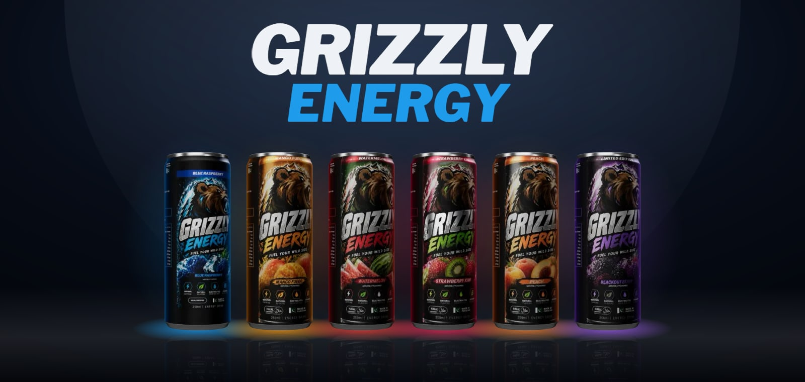

# Grizzly Energy

### *Fuel your wild side.*

**A real-time 3D product website you can pick up, turn over and crack open.**
<br>
One continuous WebGL scene carries a halal energy drink from Pakistan from the first frame to the checkout.

<br>

[](https://react.dev/)
[](https://threejs.org/)
[](https://gsap.com/)
[](https://www.typescriptlang.org/)
[](https://vitejs.dev/)
[](https://playwright.dev/)

[**The experience**](#-the-experience) · [**Play with it**](#-play-with-it) · [**Quick start**](#-quick-start) · [**Under the hood**](#-under-the-hood) · [**Before launch**](#-before-launch)

</div>

<br>

<table align="center">
<tr>
<td align="center"><h2>12</h2><sub>cans in one live scene</sub></td>
<td align="center"><h2>6</h2><sub>flavors, one limited</sub></td>
<td align="center"><h2>12</h2><sub>choreographed 3D moments</sub></td>
<td align="center"><h2>0</h2><sub>audio files: every sound is synthesised</sub></td>
<td align="center"><h2>15</h2><sub>pages prerendered to HTML</sub></td>
<td align="center"><h2>109</h2><sub>end-to-end tests</sub></td>
</tr>
</table>

<br>

## 🥫 The range

<table>
<tr>
<td align="center" width="16%">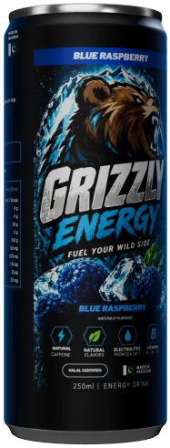<br><b>Blue Raspberry</b><br></td>
<td align="center" width="16%">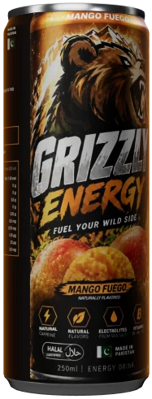<br><b>Mango Fuego</b><br></td>
<td align="center" width="16%">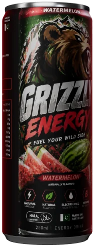<br><b>Watermelon</b><br></td>
<td align="center" width="16%">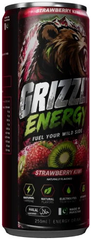<br><b>Strawberry Kiwi</b><br></td>
<td align="center" width="16%">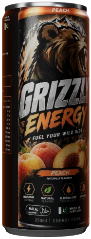<br><b>Peach</b><br></td>
<td align="center" width="16%">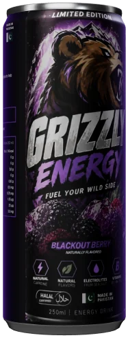<br><b>Blackout Berry</b><br><sub>LIMITED EDITION</sub><br></td>
</tr>
</table>

Each flavor's accent colour drives the whole scene: the colour wave across the backdrop, the back light behind the can, the gel in the metal's reflections, the lit label blocks and the UI accents. On every can: natural caffeine from green coffee beans, B vitamins, electrolytes from sea salt and added Zamzam water. 250 ml, made in Pakistan.

## 🎬 The experience

The home page is one scroll-driven film. A pinned WebGL canvas sits behind the page, and each section is a waypoint on a single GSAP timeline that moves the camera, the cans, the light and the stage together.

<table>
<tr>
<td width="50%">
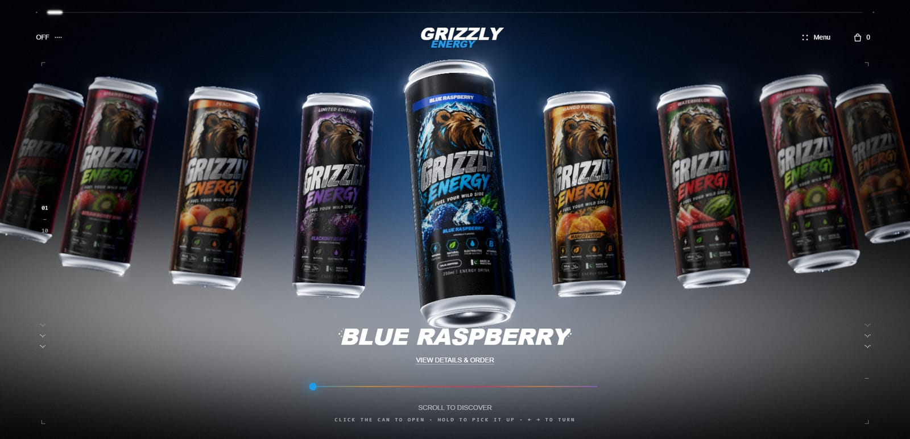
<p><b>01 · The wall.</b> A symmetric fan of twelve cans in a lit studio. The centre can is sharp and the rest fall softly out of focus, like a real lens. On the first visit, a can's lid fills the screen and the tab cracks open before the ring rises into place.</p>
</td>
<td width="50%">
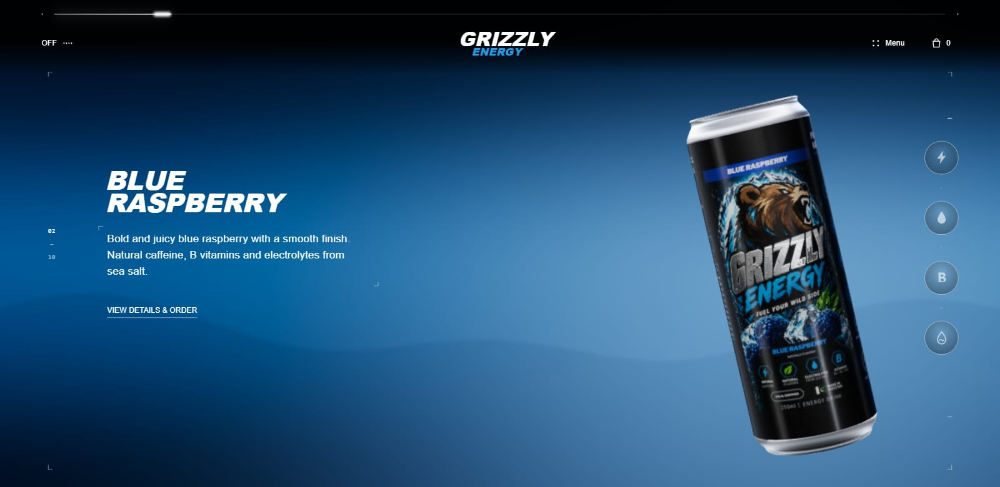
<p><b>02 · The flavor.</b> The camera swings round and the whole can floats beside its story. Every spec fans in beside it on a leader line pinned to the can, riding it as it bobs and leans. Frost creeps up the label from the base, then melts into running drops.</p>
</td>
</tr>
<tr>
<td>
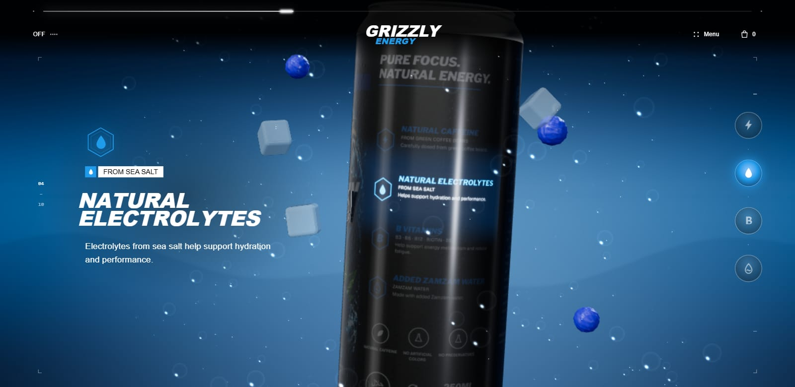
<p><b>03–06 · The label.</b> The whole can turns to its side panel and lights one benefit at a time. Between chapters it makes one full turn, scrubbed by your scroll. On electrolytes, the air becomes the drink: fizz streams upward and fruit drifts past.</p>
</td>
<td>
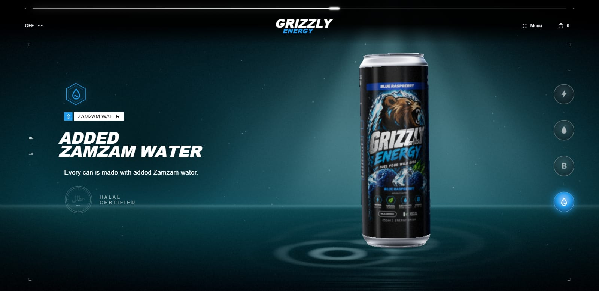
<p><b>06 · The source.</b> The pace slows. The can stands on still water over its own reflection, rings spread from its base, a single drop of light falls, and the halal seal draws itself line by line.</p>
</td>
</tr>
<tr>
<td colspan="2">
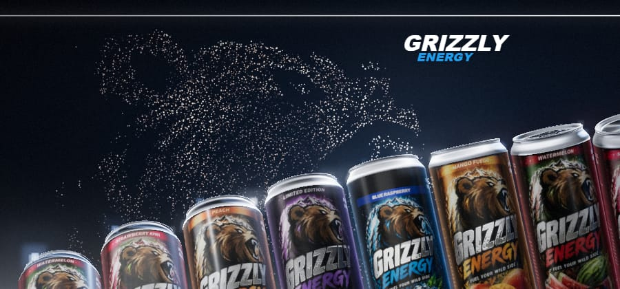
<p><b>08 · The pack.</b> Every can drops into one tight, twisting row. Above it, the grizzly from the label assembles out of thousands of drifting particles, breathes while you watch, and scatters when you move on. Then the camera rises out of the studio into the open night: aurora, mountains and mist, with the moon drawn at <i>tonight's</i> real phase.</p>
</td>
</tr>
</table>

## 🕹 Play with it

| | Do this | Where | And |
|:-:|---|---|---|
| 🥫 | **Click** the centre can, or press <kbd>O</kbd> | Hero | The lid tips toward you, the tab cracks with a hiss, and cold mist rolls out |
| ✋ | **Press and hold** the centre can | Hero | It lifts out of the ring. Drag it to turn it any way you like |
| 🌀 | **Flick** while turning | Any single-can scene | It keeps spinning the way you threw it, then eases to a stop |
| 👉 | **Swipe** across the ring | Hero | The ring carries on with momentum, the background floods with the new flavor, and fruit bursts out |
| 🎞 | **Scroll fast** | Anywhere on the story | Cinema bars close in, ice-cold water flings off the can, and vapour rises off the lid |
| 🏷 | **Click a spec** | Flavor chapter (desktop) | The callouts pinned to the can jump to that benefit's chapter |
| ⌨️ | <kbd>←</kbd> <kbd>→</kbd> · <kbd>Shift</kbd> + <kbd>↑</kbd> <kbd>↓</kbd> | Home, product pages | Turn and tilt the can like a model viewer |
| 📱 | **Tilt** your phone | Mobile | The can follows (iOS asks once, on your first tap) |
| 🖱 | **Hover** the wall | Desktop | Cans lean toward the pointer and chime, each in its own note |
| 📦 | **Pick flavors** | [`/mix`](src/components/PackBuilder.tsx) | Each can arcs into a 3D carton and drops into its well. A full carton lights up |

<table>
<tr>
<td width="50%">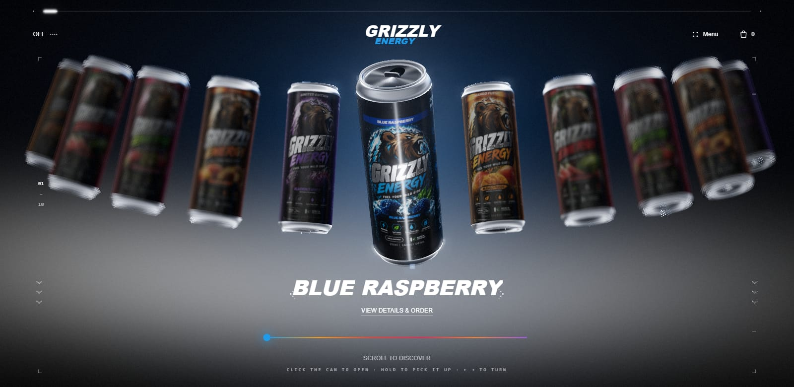</td>
<td width="50%">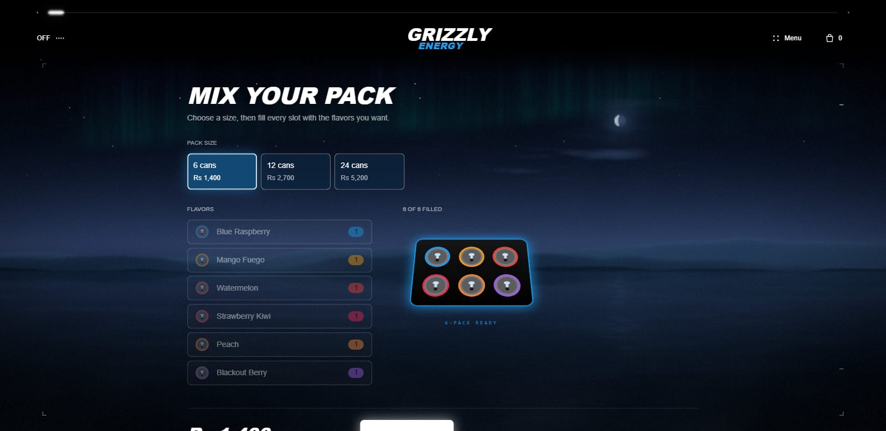</td>
</tr>
</table>

<p align="center">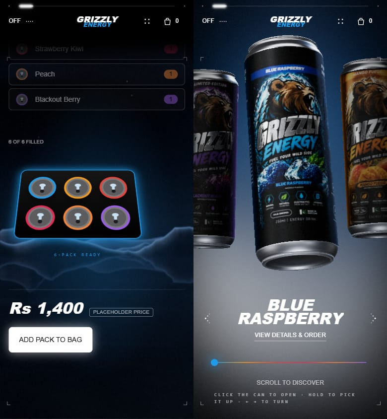</p>

## 🚀 Quick start

Requires **Node 18+**.

```bash
npm install
```

```bash
npm run dev
```

Open **http://localhost:5173**. The opening plays once per browser session. To skip it while you work, run this in the browser console:

```js
sessionStorage.setItem('grizzly_opened_v1', '1')
```

| Command | Does |
|---|---|
| `npm run dev` | Dev server with hot reload (port 5173) |
| `npm run build` | Typecheck, build, then prerender every route to static HTML |
| `npm run preview` | Serve the production build (port 4173) |
| `npm run typecheck` · `npm run lint` · `npm test` | TypeScript, ESLint (zero warnings), Vitest |
| `npm run test:e2e` | Playwright suite. It builds and serves the site itself |

<details>
<summary><b>Asset pipelines</b> (re-run after changing their sources)</summary>

<br>

| Script | Builds |
|---|---|
| `node scripts/build-labels.mjs` | Can label textures (albedo, surface, normal) from `grizzly.json` and the label art |
| `node scripts/build-ktx2.mjs` | GPU-compressed KTX2 label textures |
| `node scripts/build-bear.mjs` | The bear art behind the roar and the finale particles |
| `node scripts/build-thumbs.mjs` | Product thumbnails |
| `node scripts/build-social.mjs` | Social share images and posters |
| `node scripts/build-brand-assets.mjs` | Logo and brand assets |
| `node scripts/build-readme-banner.mjs` | The banner at the top of this README |

</details>

## 🧠 Under the hood

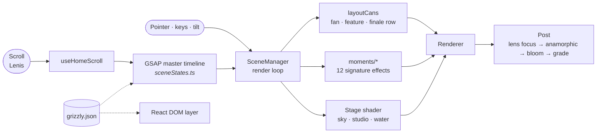

- **One scene, one story.** [`sceneStates.ts`](src/webgl/sceneStates.ts) maps every page section to a pose: camera, can, light and stage. The GSAP timeline is built from that list, so a new section is one new entry.
- **Moments, not spaghetti.** Each signature effect is a small class in [`src/webgl/moments/`](src/webgl/moments) with `update()` and `dispose()`. It nudges the frame's copy of the timeline and never owns the loop. Every file opens with its contract: trigger, what persists, what is scroll- / pointer- / time-driven, WebGL vs DOM, and the fallback.

  | Moment | | Moment | |
  |---|---|---|---|
  | `opening` | First-visit lid close-up and crack | `zamzamPool` | Still water, light shafts, ripples, the drop |
  | `canCrack` | Click to open | `ghostText` | Tagline type inside the scene |
  | `frostMelt` | Frost that melts into drops | `finaleGlow` | Flavor glow behind each can in the row |
  | `roar` | The bear rises on the first scroll | `bearSwarm` | The particle grizzly above the finale |
  | `fruitField` | Fruit burst on a flavor change | `iceDust` | Ice crystals drifting through every scene |
  | `effervescence` | Fizz and fruit on the electrolytes chapter | `coldSpray` | Water flung off the can on a fast scroll |

- **A can that behaves like metal.** [`canModel.ts`](src/webgl/canModel.ts) extends `MeshPhysicalMaterial` with `onBeforeCompile`. A single label texture drives brushed aluminium and lacquered ink, condensation beads at two scales, drops that run and clear a wet trail, frost, the lit benefit block and a rim light.
- **A stage drawn in one shader.** [`stage.ts`](src/webgl/stage.ts) draws the aurora, today's moon, ridge-line mountains, fog banks, a wet mirror floor, the grey product studio and the flavor colour field at half resolution. All of it blends from timeline values.
- **Reflections built in code.** [`studioEnv.ts`](src/webgl/studioEnv.ts) builds a softbox, strip lights and a flavor-coloured gel, prefiltered with PMREM. It is rebuilt when the flavor changes. There is no HDRI download.
- **A lens.** [`post.ts`](src/webgl/post.ts) adds depth-of-field without a depth buffer, anamorphic streaks on the hottest highlights, highlight-only bloom, and a finish pass with a light grade, vignette, grain and dither.
- **Film language.** Cinema bars close in on a fast scroll, a soft-box light sweeps across the can each time a chapter settles, and the can turns between chapters in step with the scroll.

<details>
<summary><b>Project map</b></summary>

```
src/
├─ App.tsx                 routes, scene lifecycle, section ↔ scene wiring
├─ components/             hero, sections, shop, product, bag, checkout, pack builder, menus
├─ hooks/                  smooth scroll, scroll → timeline, model-viewer keys
├─ data/grizzly.json       ★ the single source: brand, label, benefits, flavors, commerce copy
├─ webgl/
│  ├─ sceneManager.ts      renderer, loop, carousel, pointer, routes, quality governor
│  ├─ sceneStates.ts       the scroll story
│  ├─ canModel.ts          can materials and shader extensions
│  ├─ stage.ts · post.ts · studioEnv.ts
│  └─ moments/             the 12 signature effects
├─ styles/                 tokens.css → primitives → component sheets
├─ seo/                    per-route head, JSON-LD
└─ audio/                  synthesised UI sound
scripts/                   asset pipelines and the prerenderer
tests/e2e/                 Playwright suite
```

</details>

<details>
<summary><b>Performance</b>: fast on a phone, rich on a desktop</summary>

<br>

- **Three quality tiers** ([`devicePower.ts`](src/webgl/devicePower.ts)):
  - `HIGH`: bloom, lens focus, floor reflections, up to 2× pixel ratio.
  - `MEDIUM`: no bloom, a lighter stage.
  - `LOW`: no post-processing or reflections.

  Only a known weakness (data saver, ≤ 2 GB memory, ≤ 2 cores) pushes a device down a tier.
- **Frame-rate governor.** Below about 50 fps, the scene steps down the pixel ratio, then bloom, then the tier. It never steps back up within a visit.
- **Textures stream by need.** Every can starts at 1k. The focused can gets 2k, and 4k only in close-ups on capable high-density screens, never on phones or with data saver on.
- **The first frame comes first.** Post-processing, reflections and secondary moments are built afterwards, one idle task at a time.
- **The GPU does the motion.** Bubbles, particles and ripples animate in shaders. The render loop does no per-frame allocation, and every GPU resource is disposed.
- **Plain pages stay light.** Shop, bag and checkout redraw the backdrop at 30 fps, and phones skip the 3D scene there.

</details>

<details>
<summary><b>Accessibility</b></summary>

<br>

- `prefers-reduced-motion` is respected throughout: no opening, spin, fling, drift or tremor. Frost, mist and the bear appear in a still state.
- Every effect is decoration on top of real text. The canvas carries a text alternative.
- Keyboard model viewer (arrows turn the can, <kbd>O</kbd> opens it). Focus inside fields, sliders and dialogs is never hijacked.
- 44 px touch targets, visible focus, and an axe audit of every home section in the test suite.
- English and Urdu (right-to-left) interface strings.

</details>

<details>
<summary><b>Commerce, SEO and deployment</b></summary>

<br>

- **Shop, product pages, bag, a 6 / 12 / 24 pack builder and checkout** all run client-side. Prices are placeholders and are marked on screen. **No payment provider is connected**: checkout validates and confirms without charging anything. Prices are always re-read from the data, so tampered storage cannot change them.
- **SEO.** Every route is prerendered with its own title, description, canonical URL, Open Graph image and JSON-LD (`WebSite`, `Organization`, `Product`, `ItemList`, `BreadcrumbList`, `FAQPage`), plus `robots.txt`, `sitemap.xml` and `llms.txt`. The home page reads fully without JavaScript.
- **Deployment.** `npm run build` outputs a static `dist/`. [`public/_headers`](public/_headers) carries a strict CSP, COOP/CORP, frame denial and a Permissions-Policy that allows only the motion sensors the tilt needs. Netlify and Cloudflare Pages read it as-is. Add HSTS once HTTPS is live on the final domain.

</details>

<details>
<summary><b>Testing</b></summary>

<br>

```bash
npm run typecheck && npm run lint && npm test
```

```bash
npm run test:e2e
```

The Playwright suite covers:
- commerce state (shipping maths, undo, promo codes, tampered storage)
- axe on every section, plus keyboard and focus
- the SEO and answer-engine contract per route
- no horizontal overflow at 320 px
- the loader lifecycle
- listener and memory leaks
- reduced motion
- the no-WebGL fallback
- the security headers under the real CSP

On slower machines, use `--workers=2`. Stop any stale `vite preview` on port 4173 after changing code, because the suite reuses it.

</details>

## ✅ Before launch

Every brand fact lives in **[`src/data/grizzly.json`](src/data/grizzly.json)**, and both the site and the label generator read it. Facts that aren't confirmed yet are stored as `TODO…` values. They show as clearly marked placeholders and are never published as claims. Still open:

- [ ] Caffeine per can (the artwork shows both 160 mg/100 ml and 40 mg/can)
- [ ] Sugar per can (the artwork shows a "Zero sugar" badge and 3.6 g)
- [ ] Halal certifier and licence number
- [ ] Zamzam water source and amount
- [ ] Barcode (EAN-13)
- [ ] Prices, delivery, returns, contact details, company address, stores, social links
- [ ] Production domain and host

After editing the JSON, rebuild the labels and share images:

```bash
node scripts/build-labels.mjs && node scripts/build-social.mjs
```

## 🧭 House rules

- **Tokens only.** Colours, spacing, motion and sizes come from [`tokens.css`](src/styles/tokens.css) (CSS) and [`palette.ts`](src/webgl/palette.ts) (WebGL).
- **Animate transforms and opacity.** Keep animation state in refs outside React renders, and guard every browser API for SSR.
- **Every effect ships with its contract and its fallback.**
- Read [`AGENTS.md`](AGENTS.md), [`DESIGN.md`](DESIGN.md) and [`RULES.md`](RULES.md) before changing the experience.

<br>

<div align="center">


**GRIZZLY ENERGY**<br>
<sub>Fuel your wild side · Made in Pakistan · Halal</sub>

</div>
