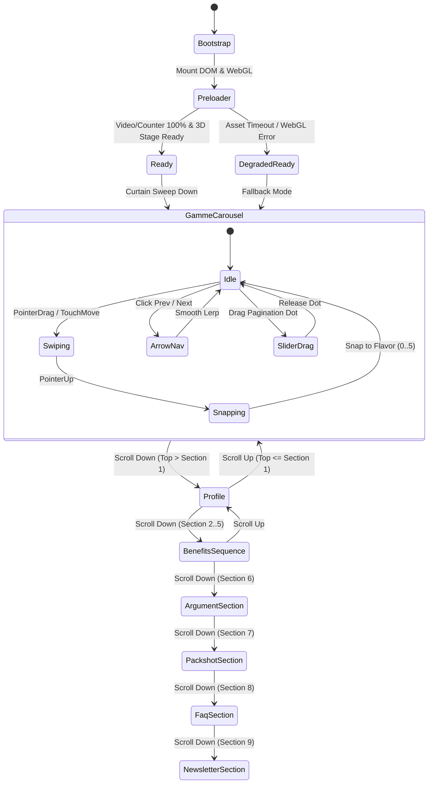

# CIAO ENERGY — INTERACTION ARCHITECTURE & STATE MACHINE MAP

## 1. Global Interaction State Machine

---

## 2. Input Modality Matrix

| Input Source | Section Target | Action | Behavior & State Updates | Fallback / Safeguard |
|:---|:---|:---|:---|:---|
| **Pointer Drag / Touch** | `#gamme` | Horizontal Drag | `swipe.direction = 1`; stops Lenis scroll; updates `carousel.target` proportionally; updates can wave. | Touch threshold `2px` to disambiguate X vs Y axis. |
| **Mouse Wheel** | `#gamme` | Vertical Wheel | Wheel pager intercepts tick; snaps smoothly to Section 1 (`duration: 1.5s`, lock: true). | If wheel delta < 4px, ignores jitter. |
| **Arrow Buttons** | `#gamme` | Click `<` or `>` | Increments/decrements `carousel.target`; plays `change` SFX; updates SplitText title. | Disables button during wrap animation if necessary. |
| **Pagination Slider** | `#gamme` | Pointer Down + Drag | Uses `setPointerCapture`; maps X coordinate to flavor index 0..5; updates active dot. | Clamps within bar bounds `[20px, 980px]`. |
| **Scroll (Lenis / Native)** | Global | Downward / Upward Scroll | Normalizes `scroll.position / scrollHeight` into master timeline progress `0.0 → 1.0`. | RAF loop updates GSAP timeline seek. |
| **Benefits Nav Rail** | `#benefits-1..4` | Click icon anchor | Programmatically scrolls via `lenis.scrollTo(targetSection)`; updates active state. | Locks audio scroll triggers during programmatic scroll. |
| **FAQ Accordions** | `#FAQ` | Click question button | Toggles `aria-expanded`; animates container height `0 → auto`; collapses other items. | Pure CSS height fallback if JS fails. |
| **Sound Toggle** | Header | Click audio button | Toggles AudioContext muted state; starts/stops equalizer wave animation. | Autoplay policy: audio starts muted until first gesture. |
| **Menu Trigger** | Header | Click `MENU` | Opens fullscreen overlay; traps focus; locks body scroll; sets `aria-expanded="true"`. | `Escape` key closes overlay; backdrop click closes. |
| **Newsletter Form** | Footer | Submit email | Validates email syntax; shows loading spinner; submits to Brevo endpoint; displays message. | Client-side RFC regex validation; server error handling. |

---

## 3. Audio Trigger Orchestration
1. **Context Unlock**: Web Audio API requires a user gesture. Event listeners (`pointerdown`, `touchstart`, `keydown`, `wheel`) execute `ctx.resume()` once.
2. **Carousel Sound (`change`)**: Emits whenever `carousel.index !== carousel.lastIndex`. Playback volume: `0.5`, rate: `1.0`.
3. **Hero Exit Sound (`enter`)**: Emits when crossing from Section 1 into Section 2 (`cur >= threshold`, going down, and not navigation-locked).
4. **Benefits Transition Sound (`benefits`)**: Emits when crossing adjacent benefits sections.
5. **UI Click Sound (`click`)**: Emits on menu open/close, menu link clicks, and FAQ question clicks.
6. **Programmatic Nav Guard (`lockNav`)**: When clicking a menu link or benefits rail icon, scroll SFX are temporarily locked for 1800ms to prevent an audio storm during high-speed smooth scroll.
